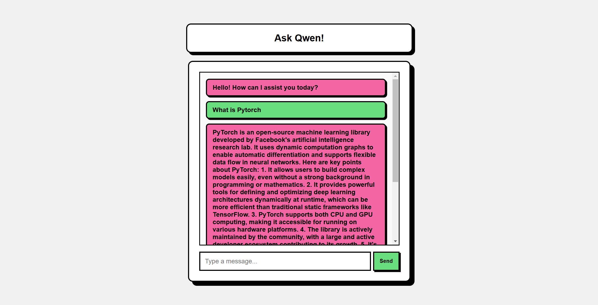

# Chatbot UI with FastAPI and Ollama

This repository contains a simple AI-powered chatbot built using **FastAPI** as the backend and **HTML, CSS, and JavaScript** for the frontend. The chatbot leverages **Ollama** for generating AI responses.

## 🚀 Features
- **FastAPI Backend**: Handles AI model interactions using Ollama.
- **CORS Support**: Allows frontend and backend to communicate seamlessly.
- **Interactive Chat UI**: Styled with modern CSS.
- **Loading Animation**: Provides user feedback while waiting for responses.

## 🖼️ Preview


## 🛠️ Installation
1. Clone the repository:
   ```sh
   git clone https://github.com/JonathanJourney99/Ollama-FastAPI.git
   ```

2. Install dependencies:
   ```sh
   uv pip install -r requirements.txt
   ```

3. Run the FastAPI server:
   ```sh
   uvicorn main:app --reload
   ```

4. Open `index.html` in your browser or use a local web server to view the chatbot UI.

## 📌 Usage
1. Start the FastAPI backend.
2. Open the chatbot UI and enter a message.
3. The AI model will generate a response in real-time.

## 🤖 API Endpoint
- **POST** `/model-generate`: Sends user input to the AI model and returns a response.
  ```json
  {
    "userprompt": "Hello!"
  }
  ```

## 📜 License
This project is open-source and available under the **MIT License**.

